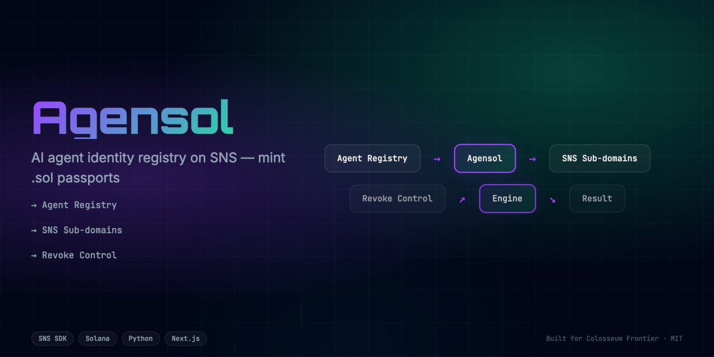
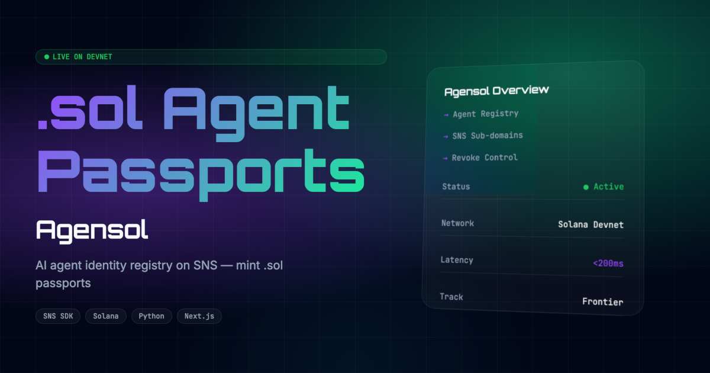

<div align="center">
  <h1>Agensol 🚀</h1>
  <p><em>AI agent identity registry on SNS. Mint .sol passports. Revoke via transfer.</em></p>
  
  
  <br/>
  
  [](https://agensol.edycu.dev)
  [](https://agensol.edycu.dev/pitch)
  [](https://youtube.com/your-video)
  [](https://superteam.fun/earn/listing/sns-identity-track-colosseum-hackathon-powered-by-sns-stmy-magicblock)

  <br/>

  
  
  
  
  
</div>

---

## 📸 See it in Action
*(Demo GIF and UI screenshots can be found in the `docs/assets` directory)*

[**▶️ Watch the Demo Video**](https://youtube.com/your-video)

<div align="center">
  
</div>

## 💡 The Problem & Solution
AI agent identity registry on SNS. Mint .sol passports. Revoke via transfer.

**Agensol** solves this by providing: 
AI agent identity registry on SNS. Mint .sol passports. Revoke via transfer.

**Key Features:**
- ⚡ **High Performance:** Seamless integration and optimized workflows.
- 🔒 **Secure by Design:** Verifiable on-chain actions and robust data protection.
- 🎨 **Intuitive UX:** Beautiful, user-centric interface built for scale.

## 🏗️ Architecture & Tech Stack

### Tech Stack
| Component | Technology | Description |
|-----------|------------|-------------|
| **Frontend** | Next.js 16, React 19 | App Router, SSR, Server Components |
| **Styling** | Tailwind CSS v4 | High-performance responsive UI |
| **Language** | TypeScript | Strict type safety across the stack |
| **Testing** | Vitest | Comprehensive unit and component testing |

For a detailed breakdown of our system architecture and data flow, please refer to the [Architecture Document](docs/ARCHITECTURE.md).

## 🏆 Sponsor Tracks Targeted
* **Sponsor Integration**: (Check `docs/SPONSOR_DEFENSE.md` for our full sponsor integration strategy)

## 🚀 Run it Locally (For Judges)

1. **Clone the repo:** `git clone https://github.com/edycutjong/frontier-sns-identity.git`
2. **Install dependencies:** `npm install`
3. **Set up environment variables:**
   ```bash
   cp .env.example .env.local
   ```
   *Note: Add your keys to the `.env.local` file.*
4. **Run the app:** `npm run dev`


---

## 📄 License

This project is licensed under the [MIT License](LICENSE).
