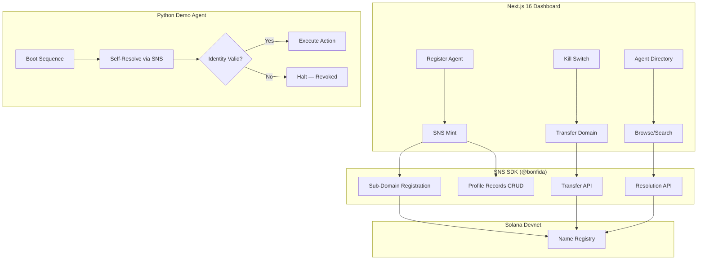

# Agensol — Technical Architecture

## System Architecture



## Tech Stack

| Layer | Technology |
|---|---|
| **Frontend** | Next.js 16, React 19, Tailwind v4 |
| **Identity** | SNS SDK (@bonfida/spl-name-service) |
| **Agent Demo** | Python 3.12 (solana-py, httpx) |
| **Database** | Supabase (registry cache) |

## SNS SDK Integration Map

| Feature | Use Case | Depth |
|---|---|---|
| **Sub-Domain Registration** | Mint `trader.myorg.sol` for agent | 🟢 Core |
| **Profile Records** | Store JSON config, permissions, system prompt hash | 🟢 Core |
| **Resolution** | Agent self-resolves identity before executing | 🟢 Star Feature |
| **Transfer** | Owner transfers domain = kill switch | 🟢 Core |
| **Lookup** | Directory browsing, search by parent domain | 🟡 Supporting |

## Database Schema

```sql
CREATE TABLE agents (
    id UUID PRIMARY KEY DEFAULT gen_random_uuid(),
    subdomain TEXT NOT NULL UNIQUE,
    parent_domain TEXT NOT NULL,
    owner_wallet TEXT NOT NULL,
    profile_record JSONB,
    status TEXT DEFAULT 'active',
    registered_at TIMESTAMPTZ DEFAULT NOW(),
    revoked_at TIMESTAMPTZ
);

CREATE TABLE agent_actions (
    id UUID PRIMARY KEY DEFAULT gen_random_uuid(),
    agent_id UUID REFERENCES agents(id),
    action_type TEXT NOT NULL,
    identity_verified BOOLEAN NOT NULL,
    result TEXT,
    created_at TIMESTAMPTZ DEFAULT NOW()
);
```

## API Routes

| Method | Path | Description |
|---|---|---|
| POST | `/api/agents/register` | Mint sub-domain + store Profile Record |
| GET | `/api/agents` | List all registered agents |
| GET | `/api/agents/:subdomain/resolve` | Resolve agent identity via SNS |
| POST | `/api/agents/:id/revoke` | Transfer domain = kill switch |
| PUT | `/api/agents/:id/config` | Update Profile Record |
